# Projekt - RGB LED kula disco sterowana dzwiekiem:

# Opis projektu:

 Uklad zlozony z 3 tranzystorow TIP41C, 3 rezystorw oraz czujnika dzwieku. Czujnik bedzie odpowiadal za wykrycie odpowiednich tonow z glosnika, 
 zidentyfikuje ton i przkaze odopowiedni impuls na tasme LED. 
 
 Filmik YT pokazujace jak zbudowac dany uklad oraz demonstruje jego dziala:
[link_do_YT](https://www.youtube.com/watch?v=G-zCNkNp4RY)

# Lista elementow:

Tranzystor TIP41C - [sklep_tranzystor](https://allegro.pl/oferta/tranzystor-tip41c-tip41-6a-100v-fairchild-to-220-10798629711)
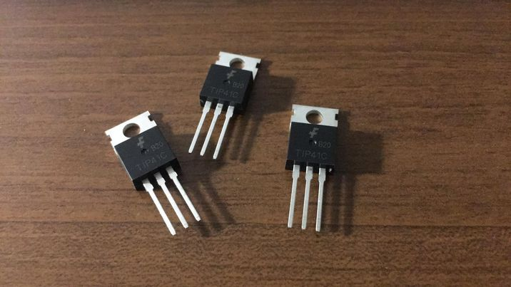

Tasma RGB LED - [sklep_tasma](https://allegro.pl/oferta/tasma-led-smd-wodoodporna-5m-rgb-kolorowa-pilot-10192557011)
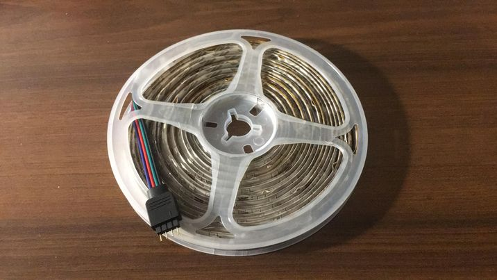

Zasilacz do taśmy LED
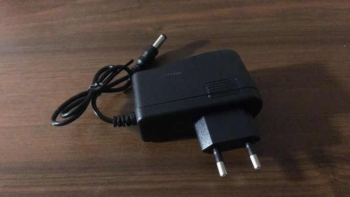

Zatrzask JACK 2.1/5.5 - [sklep_zatrzask_jack](https://allegro.pl/oferta/szybkozlacze-komplet-g55-gniazdo-zasilania-2-1-5-5-10807172353)
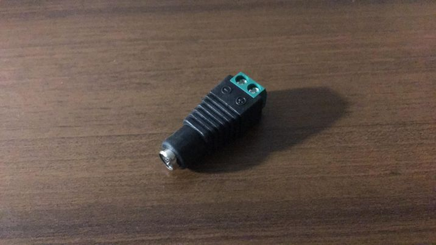

Arduino UNO - [sklep_ardunino_uno](https://allegro.pl/oferta/zestaw-startowy-do-arduino-uno-r3-atmega328-ch340-10102800766)
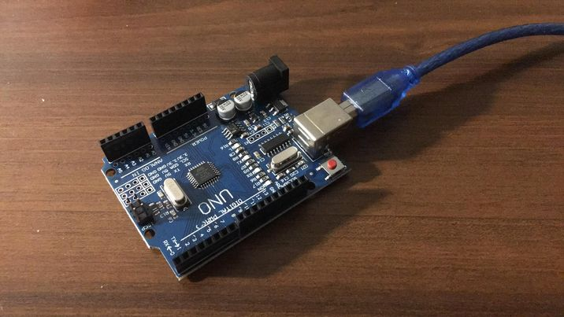

Rezystor 1kOhm - [sklep_rezystor](https://allegro.pl/oferta/zestaw-startowy-do-arduino-uno-r3-atmega328-ch340-10102800766)
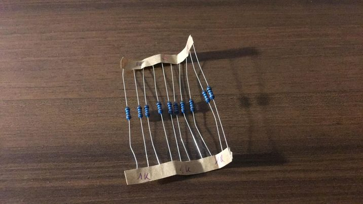

Czujnik dzwięku
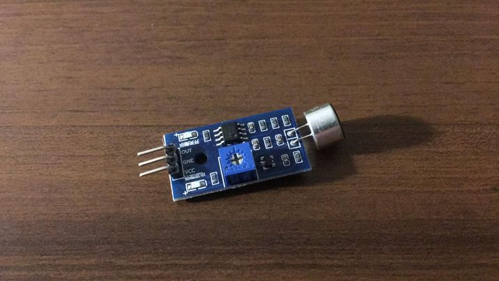

# Schemat Eagle:

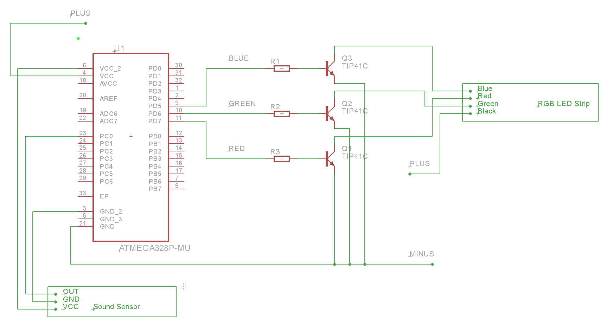

# Etapy budowy:

Rzeczy potrzebne do zbudowania ukladu:


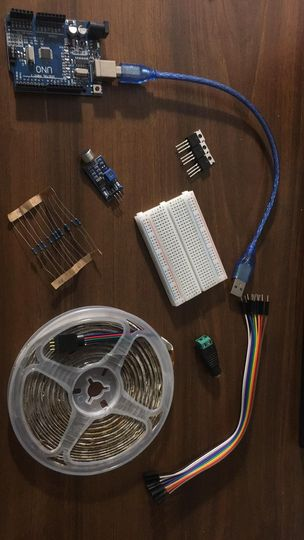


Montujemy tranzystory na plytce. Na wysokosci bazy przy kazdym z tranzystorow wpinamy rezystory 1kOhm. Pod jedna z nozek rezystora wpinamy przewod 
i wpinamy odpowiednio pod `.tranzystor nr 1 -> pin 11` na plytce Arduino, `tranzystor nr 2 -> pin 10` i `tranzystor nr 3 -> pin 9`. 

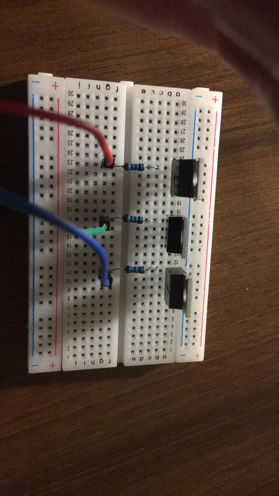
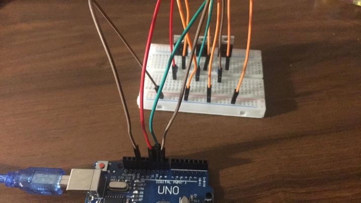


Wyjscie z emitera podpinamy pod GND oraz GND z plytki rowniez podpinamy pod GND. 


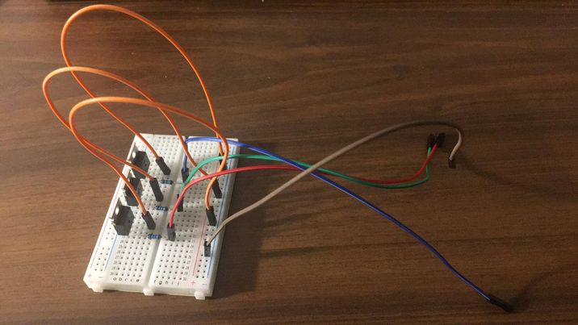


Teraz laczymy czujnik dzwieku z plytka Arduino odpowiednio: `OUT -> A0 | Analog in (23 pin)`,
`GND -> GND | (3 lub 5 pin)`, `VCC -> VCC | (4 lub 6 pin)`. Gotowe polaczenia znajduja sie na zdj. ponizej.


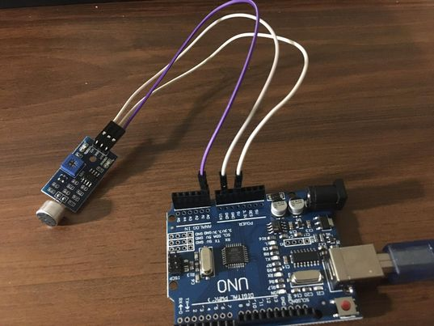


Zostalo podpiecie zyly o odpowiednich kolorach tasmy LED do kolektorow tranzystorw (od lewej patrzac na zdj tranzystor nr 1 potem 2 i 3 ): `RED -> tranzystor 1`,
`GREEN -> tranzystor 2`, `BLUE -> tranzystor nr 3`.Ostatni z wejsc to zasilanie do tasmy LED: `BLACK -> plus na plytce`. 


Teraz musimy podpiac zasilanie do tasmy LED uzyjemy zatrzasku JACK 2.1/5.5 zenskiego,podpinamy plus do tego samego rzedu co kolor czarny pochodzacy z tasmy LED 
oraz minus do rzadu gdzie mamy wpiety GND z emiterow tranzystorwo oraz plytki Arduino.


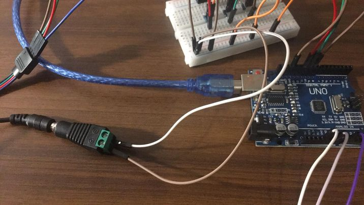


Teraz czas na kodowanie w tym celu podpinamy wejscie USB-B na plytce Arduino do laptopa na ktorym mamy srodowisko do programowiania w jezyku **C++**:

Pozwalana na skojarzenie pinow z nazwa, ktora bedziemy wykorzystywac w kodzie:

```cp
#define Rpin 11						
#define Gpin 10
#define Bpin 9
#define czujnik_sygnal A0
```

Tworzymy zmienne oraz okreslamy wartosci sygnalu do ktorego bedziemy przyrownywac sygnal zfiltrowany:

```cp
float wartosc=0, sygnal_zfiltrowany = 0, przedzial[] = {21, 26};
```

Okreslamy czestotliwosc CPU funkcja Serial.begin() oraz okreslamy piny jako wejscie badz wyjscie
funkcje pinMode():

```cp 
void setup () { 
  Serial.begin (9600);
  pinMode(czujnik_sygnal, INPUT);
  pinMode(Gpin, OUTPUT);
  pinMode(Rpin, OUTPUT);
  pinMode(Bpin, OUTPUT);
}
```

Zczytujemy analogowa wartosc z czujnika i zamieniamy ja na cyfrowa, po czym funkcja FiltrLP() 
filtrujemy sygnal filtrem cyfrowym pierwszego rzedu dolnoprzepustowym, do okreslenia ram wartosci 
sygnalu posluzylem sie funkcja kreslenia w srodowisku Arduino (zdjecie ponizej kodu), kolejnym 
krokiem bedzie przyrownywanie wartosci do zfiltrowanych do kilku wartosci z przedzialu:

```cp
void loop () {
  wartosc=analogRead(czujnik_sygnal)*(5.0/128.0);
  
  FiltrLP(wartosc);
  
  Serial.println(sygnal_zfiltrowany);
  
  if(sygnal_zprzedzialowany>przedzial[1]){
      digitalWrite(Rpin,HIGH);
      digitalWrite(Bpin,LOW);
      digitalWrite(Gpin,LOW);
      delay(1);
    } else if(sygnal_zprzedzialowany>przedzial[0] && sygnal_zprzedzialowany<przedzial[1]){
      digitalWrite(Gpin,HIGH);
      digitalWrite(Bpin,LOW);
      digitalWrite(Rpin,LOW);
      delay(1);
    } else if(sygnal_zprzedzialowany<przedzial[0]){
      digitalWrite(Bpin,HIGH);
      digitalWrite(Rpin,LOW);
      digitalWrite(Gpin,LOW);
      delay(1);
    }
}
```

Filtr cyfrowy pierwszego rzadu dolnoprzepustowy:

```cp
void FiltrLP(float sygnal) {
  sygnal_zfiltrowany = (0.945*sygnal_zfiltrowany) + (0.0549*sygnal);
}
```

Okreslenie wartosci sygnalu:


Testujemy gotowy uklad:

[test](https://youtu.be/P37CNaUVJhc)
