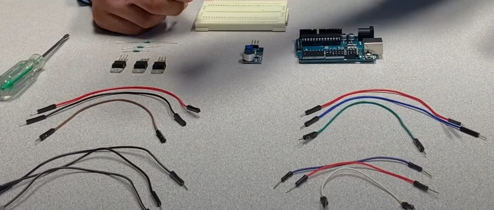
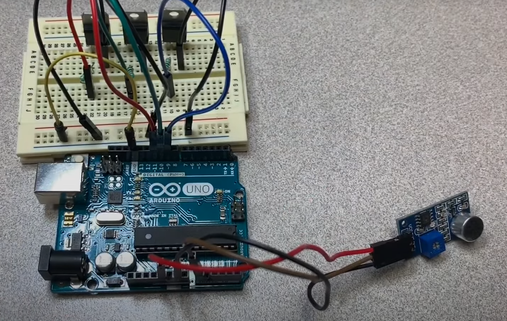
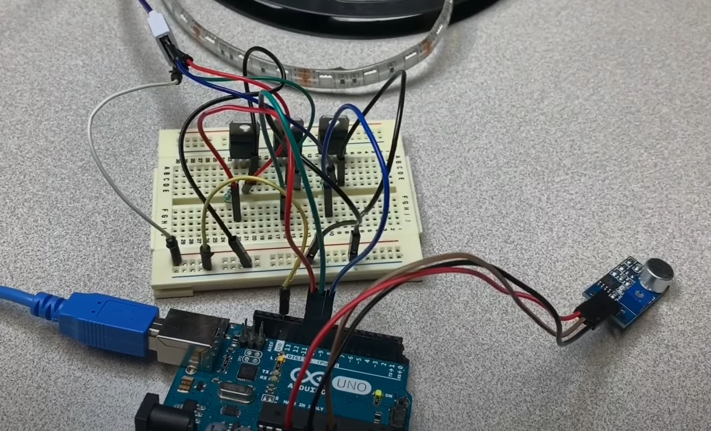
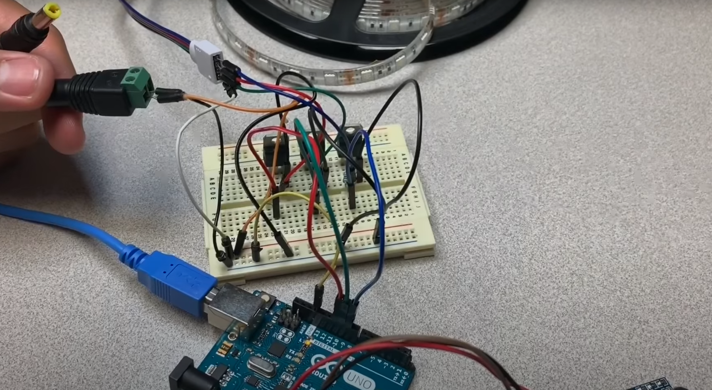
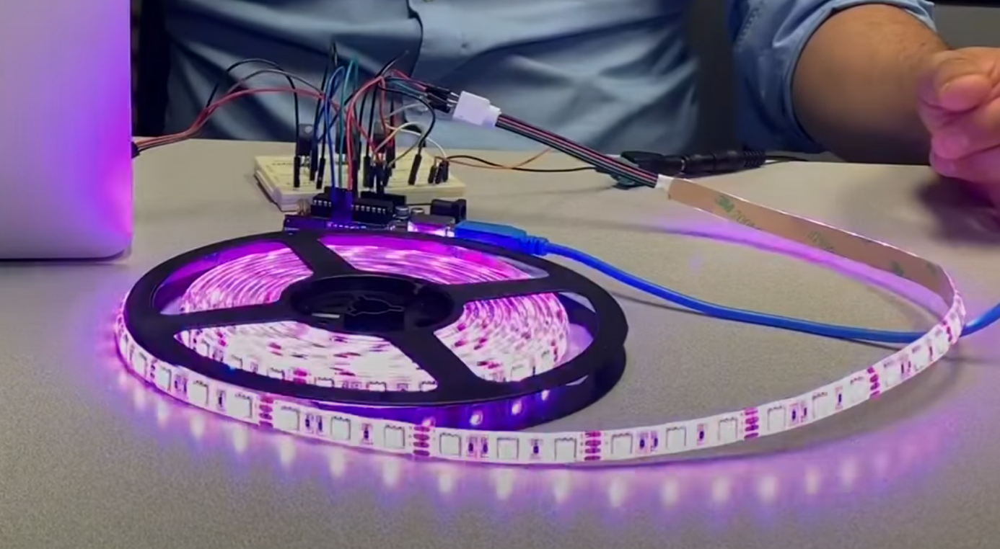

# Projekt - RGB LED kula disco sterowana dzwiekiem:

# Opis projektu:

 Uklad zlozony z 3 tranzystorow TIP41C, 3 rezystorw oraz czujnika dzwieku. Czujnik bedzie odpowiadal za wykrycie odpowiednich tonow z glosnika, 
 zidentyfikuje ton i przkaze odopowiedni impuls na tasme LED. 
 
 Filmik YT pokazujace jak zbudowac dany uklad oraz demonstruje jego dziala:
[link_do_YT](https://www.youtube.com/watch?v=G-zCNkNp4RY)

# Lista elementow:

Tranzystor TIP41C - [sklep_tranzystor](https://allegro.pl/oferta/tranzystor-tip41c-tip41-6a-100v-fairchild-to-220-10798629711)

Tasma RGB LED - [sklep_tasma](https://allegro.pl/oferta/tasma-led-smd-wodoodporna-5m-rgb-kolorowa-pilot-10192557011)

Zatrzask JACK 2.1/5.5 - [sklep_zatrzask_jack](https://allegro.pl/oferta/szybkozlacze-komplet-g55-gniazdo-zasilania-2-1-5-5-10807172353)

Arduino UNO - [sklep_ardunino_uno](https://allegro.pl/oferta/zestaw-startowy-do-arduino-uno-r3-atmega328-ch340-10102800766)

Rezystor 1kOhm - [sklep_rezystor](https://allegro.pl/oferta/zestaw-startowy-do-arduino-uno-r3-atmega328-ch340-10102800766)

# Schemat Eagle:

# Etapy budowy:

Rzeczy potrzebne do zbudowania ukladu:

Montujemy tranzystory na plytce. Na wysokosci bazy przy kazdym z tranzystorow wpinamy rezystory 1kOhm. Pod jedna z nozek rezystora wpinamy przewod 
i wpinamy odpowiednio pod tranzystor nr 1 -> pin 11 na plytce Arduino, tranzystor nr 2 -> pin 10 i tranzystor nr 3 -> pin 9. Wyjscie z emitera 
podpinamy pod GND oraz GND z plytki rowniez podpinamy pod GND. Teraz laczymy czujnik dzwieku z plytka Arduino odpowiednio: OUT -> A0 | Analog in (23 pin),
GND -> GND | (3 lub 5 pin), VCC -> VCC | (4 lub 6 pin). Gotowe polaczenia znajduja sie na zdj. ponizej.

Teraz czas na kodowanie:

Zostalo podpiecie zyly o odpowiednich kolorach tasmy LED do kolektorow tranzystorw: BLUE -> tranzystor nr 3,  

